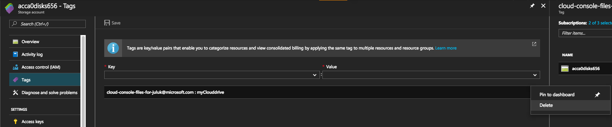
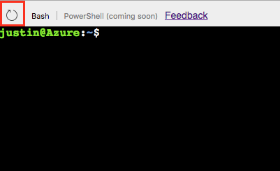
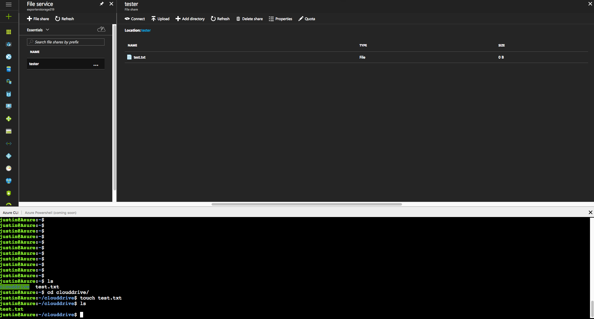
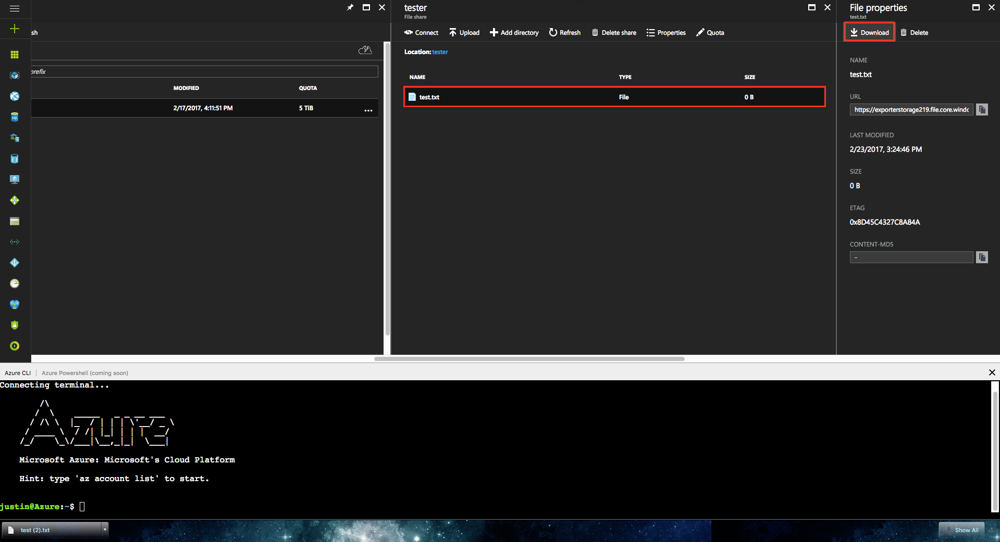

# Persisting storage (preview)
The Cloud Console allows users to attach their own fileshare held in Azure Storage to maintain file persistence across console sessions. 
It is highly recommended to mount a file share to enable use cases such as
* Remember default subscription settings for Azure CLI across Cloud Console sessions
* Upload/download local files to/from the Cloud Console via `clouddrive`
* Persist ssh keys stored in $Home/user/.ssh across sessions (captured in mounted file share's .img)

When running `createcloudddrive` Cloud Console will persist files in two ways:
1. Persist all files in your `$Home` directory as a 5GB image in the specified file share and sync changes automatically <br>
```
/Home/<User> -----> fileshare.storage.windows.net/fileshare/.cloudconsole/user.img
 ```
2. Place a `clouddrive` subdirectory within your $Home for [individual file interaction via Azure Portal](#upload-or-download-local-files) <br>
```
/Home/<User>/clouddrive -----> fileshare.storage.windows.net/fileshare
```
Anything stored in Azure Files is subject to [regular Azure Storage pricing.](https://azure.microsoft.com/en-us/pricing/details/storage/files/)

**NOTE** During private preview only file shares in West US may be mounted.
## Quick command
1. Open Cloud Console
2. Check subscription setting is correct with `az account show`
3. Run `createclouddrive` specifying an existing file share (add `-F` if file share does not exist):
```
createclouddrive -s mySub -g myRG -n exName -f myShare
```

## How it works
Persisting files in Cloud Console follows this process: <br>
1. Specify a file share **in West US** to mount via `createclouddrive` command
2. Cloud Console will place a "tag" on the storage account specifying the file share to mount
3. On every subsequent console session, Cloud Console searches for the "tag" on start and it mounts on /usr/username/clouddrive if found

The "tag" is added to the selected storage account using the format: <br>

| Key | Value |
|:-------------:|:-------------:|
|cloud-console-files-for-user@domain.com|fileshareName|

## Mounting file share walkthrough
To mount an Azure Files storage account: <br>
1. Open a Cloud Console session <br>
2. Run: <br>
```
createclouddrive -s mySub -g myRG -n exName -f myShare
```
If successful you will be prompted to restart the console or to create a new storage account if the storage account does not already exist.
```
justin@Azure:~$ createclouddrive -s justin-internal-sub -g acc-a0 -n acca0disks656 -f exampleclouddrive
INFO: Setting subscription (juluk-subscription)
INFO: User Principal Name: juluk@microsoft.com
INFO: Getting storage account (acca0disks656) in resource group (acc-a0)
{
  "accessTier": null,
  "creationTime": "2017-03-02T19:43:03.975183+00:00",
  "customDomain": null,
  "encryption": null,
  "id": "/subscriptions/ex-subscription-guid/resourceGroups/acc-a0/providers/Microsoft.Storage/storageAccounts/acca0disks656",
  "kind": "Storage",
  "lastGeoFailoverTime": null,
  "location": "westus",
  "name": "acca0disks656",
  "primaryEndpoints": {
    "blob": "https://acca0disks656.blob.core.windows.net/",
    "file": "https://acca0disks656.file.core.windows.net/",
    "queue": "https://acca0disks656.queue.core.windows.net/",
    "table": "https://acca0disks656.table.core.windows.net/"
  },
  "primaryLocation": "westus",
  "provisioningState": "Succeeded",
  "resourceGroup": "acc-a0",
  "secondaryEndpoints": null,
  "secondaryLocation": null,
  "sku": {
    "name": "Standard_LRS",
    "tier": "Standard"
  },
  "statusOfPrimary": "available",
  "statusOfSecondary": null,
  "tags": {
    "cloud-console-files-for-juluk@microsoft.com": "exampleclouddrive"
  },
  "type": "Microsoft.Storage/storageAccounts"
}
INFO: Provision succeeds. Please type 'exit' to restart the console.
```

You should now be able to upload/download to/from your fileshare from the `clouddrive` directory within the Cloud Console.
Uploading/downloading from/to your local machine can be done via the Azure Files portal blades.

To see more details run `createclouddrive -h`: <br>
```
Options: <br>
  -s | Subscription ID or name <br>
  -g | Resource group name <br>
  -n | Storage account name <br>
  -F | Create storage account if it doesn't exist <br>
  -f | Fileshare name <br>
  -? | -h | --help Shows this usage text <br>
```
## Unmounting a file share
To unmount a fileshare from Cloud Console:
1. Delete the storage tag on the storage account <br>

2. Recycle your Cloud Console <br>


Your Cloud Console should now be cleared of any mounted shares and open to mount another.

## Updating a file share
1. Follow process to [unmount a file share](#unmounting-a-file-share)
2. Use `createclouddrive` to mount your new file share

## Show tagged file share
To find details about your mounted storage run `df`. The filepath to clouddrive will show your storage account name and fileshare in the url.

`//storageaccountname.file.core.windows.net/filesharename`

```
justin@Azure:~$ df
Filesystem                                         1K-blocks    Used  Available Use% Mounted on
overlay                                             29711408 5577940   24117084  19% /
tmpfs                                                 986716       0     986716   0% /dev
tmpfs                                                 986716       0     986716   0% /sys/fs/cgroup
/dev/sda1                                           29711408 5577940   24117084  19% /etc/hosts
shm                                                    65536       0      65536   0% /dev/shm
//exporterstorage219.file.core.windows.net/tester 5368709120      64 5368709056   1% /home/justin/clouddrive
justin@Azure:~$
```

## Upload or download local files
You can utilize the Portal GUI for Azure Files to upload or download files to/from storage.
Editing/removing/adding files from within the console will also reflect in the File Storage GUI upon blade refresh.

1. Navigate to the mounted fileshare

2. Select target file in Portal
3. Hit "Download"


**Note** <br>
If you need to download a local file that exists in your $Home directory:
1. Copy it to `clouddrive` <br>
2. Follow [previous steps](#upload-or-download-local-files) <br>

## Next steps
[ACC Quickstart](../Get-started/acc-quickstart.md) <br>
[About Azure File storage](https://docs.microsoft.com/azure/storage/storage-introduction#file-storage) <br>
[Learn more about Storage tags](https://docs.microsoft.com/azure/azure-resource-manager/resource-group-using-tags) <br>