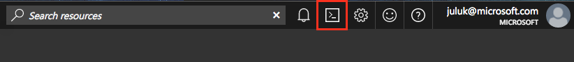
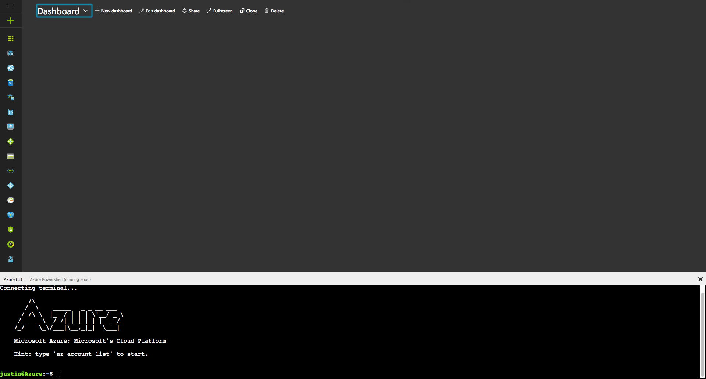

# Azure Cloud Console (preview)
Azure is excited to provide a free, browser-accessible Bash shell to every Azure user from the Azure Portal. 
This shell is your personal sandbox enabling you to deploy, manage, and develop Azure resources or integrate into your existing workflows.

Shortlink to this documentation is at [aka.ms/accbetadocs](https://www.aka.ms/accbetadocs).

## Preview access 
### Internals
1. Navigate to [aka.ms/accbeta] (https://www.aka.ms/accbeta). This shortlink provides full Portal access so it can be used as a replacement link.

2. Launch the console via the terminal icon on the top navigation pane.

### Azure Advisors
1. Get whitelisted from the Advisor deck shared out (we whitelist every Wednesday during private preview)
2. Navigate to [aka.ms/accbeta] (https://www.aka.ms/accbeta). This shortlink provides full Portal access so it can be used as a replacement link.
3. Launch the console via the terminal icon on the top navigation pane.

### Concepts
* Machine state and files do not persist beyond the active session by default
  * You may [mount Azure storage to persist files.](/How-to/acc-persisting-storage.md) 
* Permissions are set as a regular user
* Console runs on an ephemeral container provided on a per-session, per-user basis
* Console times out after 10 minutes without output activity (Hit enter to reactivate)

### Features
* A browser-based BASH workstation built for Azure
* Automatic authentication
* Bring your own Azure Files for file persistence

Check the full [feature list here](Concepts/acc-features.md).

## Example use cases
* Try out the new Azure CLI 2.0
* SSH directly from the Azure Portal
* Manage resources via GUI or CLI, side-by-side
* Test documentation scripts without leaving your browser

## Pricing
The Cloud Console is a free service to all Azure customers. Regular storage costs apply if mounting an Azure file share.

## Supported browsers
The Cloud Console is recommended for Chrome, Edge, and Safari. 

The console is supported for Chrome, Firefox, Safari, IE, and Edge, but shortcut functionality will be subject to specific browser settings.

## Feedback
### Internals
1. aka.ms/accfeedback  
2. Cloud Console Discussion on Microsoft Teams  

### Azure Advisors
1. Utilize the Azure Advisors Yammer group

## Known Preview Issues
1. CLI 2.0 cmd and autocomplete performance
2. Portal tabs left inactive for long periods of time will have tokens expire, this can disable reactivating the console. Please refresh your page to fix this.
3. Shortcuts (ctrl-v and ctrl-c) not supported on Windows during Preview
4. Right-click paste not supported on IE/Firefox